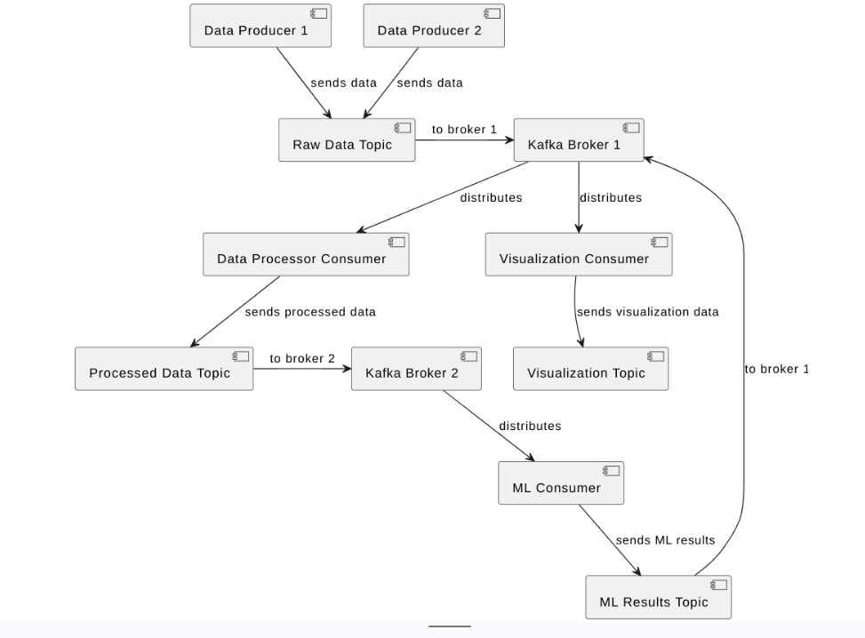
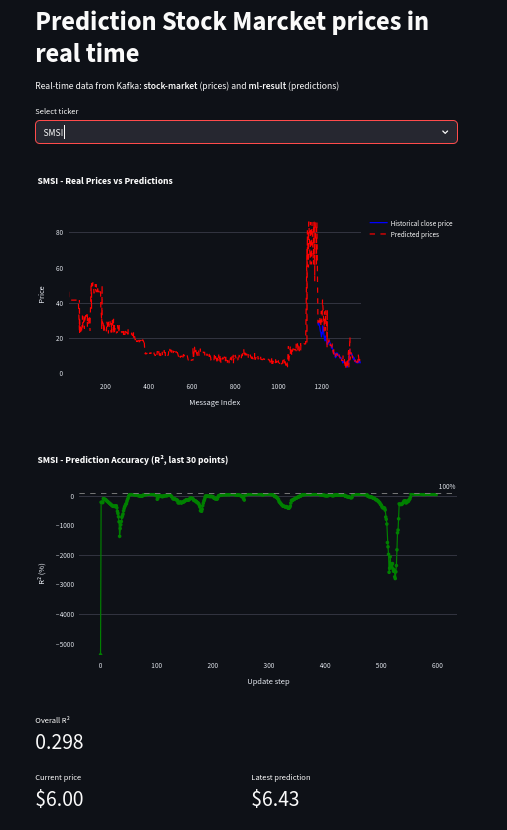

# Price prediction for stock market in real life

## Run kafka:

```bash
./run.sh
```

## Implementations info
I implemented schema:



And try to implement predictor next prices on stock market like realtime

View status on http://0.0.0.0:8501.

Example dashbord:

